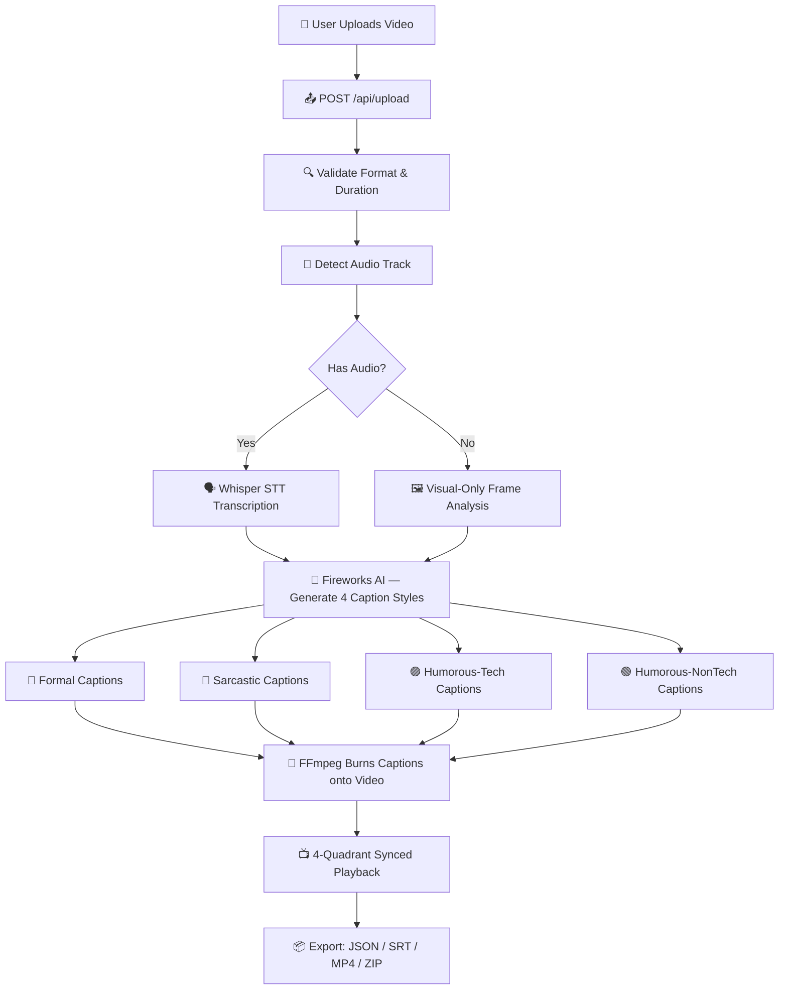

# 🎬 Vdcap.AI — Presentation & Video Demo Script

> **Project**: Vdcap.AI — 4-Style AI Video Captioning Platform  
> **GitHub**: [github.com/rishabharaj/AI-caption-generator](https://github.com/rishabharaj/AI-caption-generator)  
> **Built by**: Rishabharaj Sharma  

---

## 📋 Table of Contents

1. [Self Introduction](#-self-introduction)
2. [Project Introduction](#-project-introduction)
3. [Problem Statement](#-problem-statement)
4. [Solution Overview](#-solution-overview)
5. [Tech Stack](#-tech-stack)
6. [Architecture & Workflow](#-architecture--workflow)
7. [Key Features Deep Dive](#-key-features-deep-dive)
8. [Live Demo Script](#-live-demo-script-step-by-step)
9. [Code Walkthrough Talking Points](#-code-walkthrough-talking-points)
10. [Future Scope](#-future-scope)
11. [Closing Statement](#-closing-statement)
12. [Q&A Prep](#-qa-prep)

---

## 🧑‍💻 Self Introduction

> **[Speak to camera / audience]**

*"Hello everyone! My name is **Rishabharaj Sharma**, and I'm a passionate developer who loves building AI-powered applications that solve real-world problems. Today, I'm excited to present **Vdcap.AI** — a full-stack AI video captioning platform that I designed and developed from scratch. This project combines my interests in artificial intelligence, video processing, and modern web design into one cohesive product."*

---

## 🎯 Project Introduction

> **[Show landing page of Vdcap.AI]**

*"So what is Vdcap.AI? In simple terms, it's an AI-powered platform that takes any short video you upload and automatically generates **four different styles of captions** for it — all at once. You can then compare these caption styles side-by-side in a beautiful synchronized 4-quadrant video player, and export everything in multiple formats."*

### The Four Caption Styles:

| # | Style | Tone | Example |
|---|-------|------|---------|
| 1 | 🔵 **Formal** | Professional, documentary-style | *"The presenter demonstrates the software interface to the audience."* |
| 2 | 🩷 **Sarcastic** | Witty, tongue-in-cheek | *"Oh look, another person clicking buttons. Revolutionary."* |
| 3 | 🟣 **Humorous-Tech** | Nerdy humor with tech references | *"User executes a recursive demo loop — stack overflow imminent."* |
| 4 | 🟢 **Humorous-NonTech** | Casual, everyday humor | *"They're just vibing with the computer at this point, honestly."* |

*"The idea is that content creators, educators, and marketers often need captions in different tones for different audiences — and doing that manually is tedious and time-consuming. Vdcap.AI automates this entire process."*

---

## ❓ Problem Statement

> **[Show a slide or speak directly]**

*"Let me explain the problem I set out to solve:"*

- 📹 Video content is exploding — over **500 hours** of video are uploaded to YouTube every minute
- ♿ Captions improve accessibility for deaf and hard-of-hearing viewers
- 📈 Captioned videos get **40% more views** on social media
- 🌍 Captions help non-native speakers understand content better
- 😫 **But** — manually writing captions is slow, expensive, and boring
- 🎭 **And** — one size does NOT fit all. A formal tutorial needs different captions than a comedy sketch

*"Existing captioning tools give you ONE style. I thought — why not give you FOUR at once, and let you pick what works best?"*

---

## 💡 Solution Overview

> **[Show architecture diagram or UI]**

*"Vdcap.AI solves this with a 5-step automated pipeline:"*

```
┌─────────────┐    ┌─────────────┐    ┌─────────────┐    ┌─────────────┐    ┌─────────────┐
│  Step 1      │    │  Step 2      │    │  Step 3      │    │  Step 4      │    │  Step 5      │
│  Upload      │───▶│  Extract     │───▶│  AI Caption  │───▶│  Burn        │───▶│  Compare     │
│  Video       │    │  Audio +     │    │  Generation  │    │  Captions    │    │  & Export    │
│              │    │  Frames      │    │  (4 Styles)  │    │  onto Video  │    │              │
└─────────────┘    └─────────────┘    └─────────────┘    └─────────────┘    └─────────────┘
```

*"Upload → Extract → Generate → Burn → Compare. Five steps, fully automated, all from one beautiful interface."*

---

## 🛠️ Tech Stack

> **[Show tech stack slide]**

### Backend
| Technology | Purpose |
|-----------|---------|
| **Python 3.10+** | Core language |
| **FastAPI** | High-performance async web framework |
| **Uvicorn** | ASGI server |
| **FFmpeg** | Video/audio processing, frame extraction, caption burning |
| **OpenCV** | Frame analysis and image processing |
| **Pillow** | Image manipulation |
| **Pydantic** | Data validation and serialization |

### AI & ML
| Technology | Purpose |
|-----------|---------|
| **Fireworks AI API** | LLM-based caption generation (GLM model) |
| **Whisper (Speech-to-Text)** | Audio transcription |
| **Mock AI Fallback** | Template-based generation when no API key |

### Frontend
| Technology | Purpose |
|-----------|---------|
| **Vanilla HTML/CSS/JS** | No heavy frameworks — fast & lightweight |
| **Glassmorphism Design** | Modern dark UI with glass blur effects |
| **CSS Animations** | Particle effects, gradient meshes, micro-interactions |
| **Google Fonts** | Inter, JetBrains Mono, Poppins, and more |

### DevOps
| Technology | Purpose |
|-----------|---------|
| **Heroku** | Cloud deployment with buildpacks |
| **YAML Config** | Centralized configuration management |
| **GitHub** | Version control and repository hosting |

*"I intentionally chose **vanilla frontend** — no React, no Vue — to keep the app lightweight and prove that stunning UI doesn't require heavy frameworks. The entire CSS file is a hand-crafted 96KB design system."*

---

## 🔄 Architecture & Workflow

> **[Show this diagram on screen]**



### Talking Points:

*"Let me walk you through the architecture:*

1. **Upload** — The user drags and drops a video (MP4, MOV, AVI, or WebM, 30s–120s duration, up to 500MB)
2. **Validation** — The backend validates the file format, size, and duration using FFprobe
3. **Audio Detection** — We check if the video has an audio track
4. **Transcription** — If audio exists, we use Whisper speech-to-text to transcribe it. If not, we fall back to visual frame analysis using OpenCV
5. **AI Generation** — The transcription + visual context is sent to Fireworks AI with 4 specialized prompts, one for each caption style
6. **Caption Burning** — FFmpeg overlays the generated captions onto 4 copies of the video using the `drawtext` filter
7. **Playback** — The frontend plays all 4 videos in sync, so you can directly compare the styles
8. **Export** — Download captions as JSON, SRT subtitles, individual MP4s, or a master ZIP bundle"*

---

## 🌟 Key Features Deep Dive

> **[Show each feature while talking]**

### 1. 🖥️ Stunning Dark Glassmorphism UI
*"The frontend features a handcrafted dark theme with animated gradient mesh backgrounds, floating particle effects, glass panels with backdrop blur, and smooth micro-animations on every interaction. It's responsive too — adapts from 4-column to 2-column to single-column layout."*

### 2. 📺 Synchronized 4-Quadrant Player
*"The heart of the app — four video players that stay in perfect sync. Play, pause, or seek in one, and all four follow. Each quadrant shows a different caption style with its own color coding."*

### 3. 🎙️ Smart Audio Detection
*"Not all videos have audio. Vdcap.AI intelligently detects whether a video has an audio track and adapts its pipeline — using speech transcription when audio is available, and pure visual analysis when it's not."*

### 4. 🧠 Multi-Style AI Prompts
*"Each caption style uses a carefully crafted prompt template. The Formal style aims for documentary-quality narration. The Sarcastic style adds witty commentary. The Tech-Humor style references programming concepts. And the Non-Tech Humor style keeps it casual and relatable."*

### 5. 📦 Rich Export Options
*"Users can export their results in multiple formats:"*
- **JSON** — Structured data for programmatic use
- **SRT** — Standard subtitle format compatible with all video players
- **MP4** — Individual videos with burned-in captions
- **ZIP** — Master archive with all formats bundled together
- **HTML Report** — Formatted summary of all caption styles

### 6. 🔄 Mock AI Fallback
*"No API key? No problem. The app includes an intelligent mock AI module that generates template-based captions using keyword matching and scene analysis — great for demos and development."*

### 7. 🧬 Fine-Tuning Pipeline
*"The project includes a training pipeline for fine-tuning on MSR-VTT and ActivityNet datasets using LoRA adapters — making it research-ready for academic projects."*

---

## 🎬 Live Demo Script (Step-by-Step)

> **[Screen recording / live demo]**

### Scene 1: Landing Page (0:00 – 0:30)
*"Here's the Vdcap.AI homepage. Notice the animated gradient background with floating particles, the sleek glass navigation bar, and the modern typography. The landing section shows our 5-step pipeline infographic that explains how the app works."*

**Action**: Scroll through the landing page slowly, highlighting the pipeline section and features.

---

### Scene 2: API Key Setup (0:30 – 0:45)
*"Before we start, let me enter my Fireworks AI API key. The key is stored locally in the browser — it never touches our server's storage. Keys must start with 'fw_' and be at least 32 characters."*

**Action**: Click on the API key input in the header, paste a key, show the validation checkmark.

---

### Scene 3: Video Upload (0:45 – 1:15)
*"Now let's upload a video. I can either click to browse, or simply drag and drop. The upload zone has a beautiful hover animation. I'll upload a 45-second clip."*

**Action**: Drag a video file into the upload zone. Show the upload progress animation.

*"The video gets uploaded to the server, and we can see a preview immediately. The app shows us the video duration, file size, and format."*

---

### Scene 4: AI Processing (1:15 – 2:00)
*"Now I'll click 'Generate Captions'. Watch the processing modal — it shows a step-by-step animation of what's happening behind the scenes."*

**Action**: Click the generate button. Show the processing modal with its animations.

*"Step 1: Extracting audio and key frames from the video. Step 2: Transcribing the audio using Whisper speech-to-text. Step 3: Sending the context to Fireworks AI to generate our four caption styles. Step 4: Burning those captions onto four copies of the video using FFmpeg. And... done!"*

---

### Scene 5: 4-Quadrant Comparison (2:00 – 3:00)
*"And here's the magic — the 4-quadrant split view! Top-left is Formal in blue, top-right is Sarcastic in pink, bottom-left is Humorous-Tech in purple, and bottom-right is Humorous-NonTech in green."*

**Action**: Play the videos. Show them syncing perfectly. Pause and resume to demonstrate sync.

*"Watch how all four players stay perfectly synchronized. When I seek to a specific moment, all four jump together. Each caption tells the same story but in completely different tones. This is incredibly useful for content creators who want to pick the right voice for their audience."*

---

### Scene 6: Caption Cards (3:00 – 3:30)
*"Below the video player, we have caption cards showing the full text for each style. Each card is color-coded to match its quadrant. You can read through all four versions at a glance."*

**Action**: Scroll to the caption cards section. Highlight the different tones.

---

### Scene 7: Export & Download (3:30 – 4:00)
*"Finally, let's export our work. I can download individual SRT subtitles for any specific style, export all captions as structured JSON, download the full set of captioned MP4 videos, or grab everything as a single master ZIP file."*

**Action**: Click each export button. Show the downloaded files briefly.

*"The ZIP includes all four MP4s, all four SRT files, the JSON data, and a formatted HTML report. Everything you need in one click."*

---

### Scene 8: Responsive Design (4:00 – 4:15)
*"One more thing — the entire app is fully responsive. Let me resize the browser. Watch how the 4-column layout gracefully adapts to 2-column, and then to single-column on mobile. Every element scales beautifully."*

**Action**: Resize the browser window to show responsive breakpoints.

---

## 💻 Code Walkthrough Talking Points

> **[Show VS Code / code editor]**

### Backend Architecture
*"The backend follows a clean, modular architecture:"*

```
backend/
├── main.py                 → FastAPI app entry, CORS, lifespan
├── config.py               → YAML config loader with Pydantic
├── api/
│   ├── routes.py           → 8 REST API endpoints
│   ├── dependencies.py     → API key validation middleware
│   └── exceptions.py       → Custom error handlers
├── services/
│   ├── video_processor.py  → FFmpeg frame + audio extraction
│   ├── audio_detector.py   → Detect if video has audio
│   ├── whisper_client.py   → Whisper STT integration
│   ├── caption_generator.py→ 4-style prompt engine
│   ├── fireworks_client.py → Fireworks AI API wrapper
│   ├── mock_ai.py          → Fallback mock AI
│   ├── caption_burner.py   → FFmpeg drawtext overlay
│   └── export_service.py   → ZIP, JSON, SRT generation
├── models/                 → Pydantic data models
└── utils/                  → FFmpeg helpers, file management
```

*"Key design decisions:"*
- **Async everywhere** — FastAPI's async support for non-blocking I/O
- **Service layer pattern** — Each service handles one responsibility
- **Configuration as code** — All settings in `config.yaml`, loaded via Pydantic
- **Graceful degradation** — Mock AI fallback when API key is unavailable

### Frontend Highlights
*"The frontend is pure HTML, CSS, and JavaScript — no build step, no node_modules. The CSS alone is 96KB of hand-crafted design system with:"*
- CSS custom properties for theming
- Glassmorphism panels with `backdrop-filter: blur()`
- CSS keyframe animations for particles and gradients
- Responsive grid with CSS Grid and Flexbox
- Smooth transitions on every interactive element

---

## 🔮 Future Scope

> **[Speak to camera / slide]**

*"Here's what I plan to add next:"*

- 🌐 **Multi-language support** — Generate captions in Hindi, Spanish, French, and more
- 🎤 **Real-time captioning** — Live webcam/stream captioning
- 🧠 **Custom fine-tuned models** — Train on domain-specific video datasets
- 👥 **User accounts & history** — Save and revisit past generations
- 📱 **Mobile app** — React Native companion app
- 🔌 **API as a service** — Public API for third-party integrations
- 📊 **Analytics dashboard** — Track caption quality metrics

---

## 🎤 Closing Statement

> **[Speak to camera / audience]**

*"To summarize — **Vdcap.AI** is a full-stack AI platform that transforms how we create video captions. It combines speech recognition, large language models, video processing, and modern web design into a seamless experience. Upload a video, get four unique caption styles, compare them side-by-side, and export everything — all in under a minute."*

*"The project demonstrates my skills in:*
- ✅ **Full-stack development** — Python backend + vanilla frontend
- ✅ **AI/ML integration** — Whisper STT + LLM-based generation
- ✅ **System design** — Clean architecture with modular services
- ✅ **UI/UX design** — Premium glassmorphism interface
- ✅ **DevOps** — Heroku deployment with proper config management

*"Thank you for watching! The source code is open on GitHub — feel free to check it out, star it, and contribute. I'd love to hear your feedback!"*

---

## ❓ Q&A Prep

> Common questions you might face and suggested answers:

### Q: Why four caption styles specifically?
*"Four gives a great variety without overwhelming the user. Formal covers professional use, Sarcastic adds entertainment, and the two humor styles cater to different audiences — tech-savvy and general."*

### Q: Why Fireworks AI instead of OpenAI?
*"Fireworks AI offers excellent performance with competitive pricing and supports vision-language models like GLM. It also provides faster inference times for our use case."*

### Q: How do you handle videos without audio?
*"The app has a smart audio detection module. If no audio is found, it extracts key frames using OpenCV, analyzes the visual content, and generates captions based purely on what's happening in the video."*

### Q: Why vanilla HTML/CSS/JS instead of React or Vue?
*"I wanted to prove that stunning, modern UI doesn't require heavy frameworks. The entire frontend is under 200KB, loads instantly, and the 96KB CSS file is a complete design system I built from scratch."*

### Q: What's the mock AI fallback?
*"When no Fireworks AI API key is provided, the app falls back to an intelligent template-based system. It uses keyword matching and scene analysis heuristics to generate plausible captions — perfect for demos and development."*

### Q: How does the 4-quadrant sync work?
*"Each quadrant uses an HTML5 `<video>` element. The main.js script listens for play, pause, and seek events on any one player and programmatically mirrors those events to the other three, keeping them in perfect sync within milliseconds."*

### Q: Is this production-ready?
*"It's deployed on Heroku and fully functional. For enterprise scale, I'd add user authentication, a job queue (like Celery), cloud storage (S3), and rate limiting — but the core pipeline is solid and production-quality."*

---

## 📝 Presentation Tips

- **Duration**: Aim for **5–7 minutes** for a demo video, **10–15 minutes** for a full presentation
- **Pace**: Speak clearly and pause between sections
- **Visuals**: Always show the app while talking — avoid blank slides
- **Energy**: Start strong with enthusiasm, especially during the demo
- **Close**: End with a call-to-action (GitHub link, feedback request)

---

> **Good luck with your presentation! 🚀**
